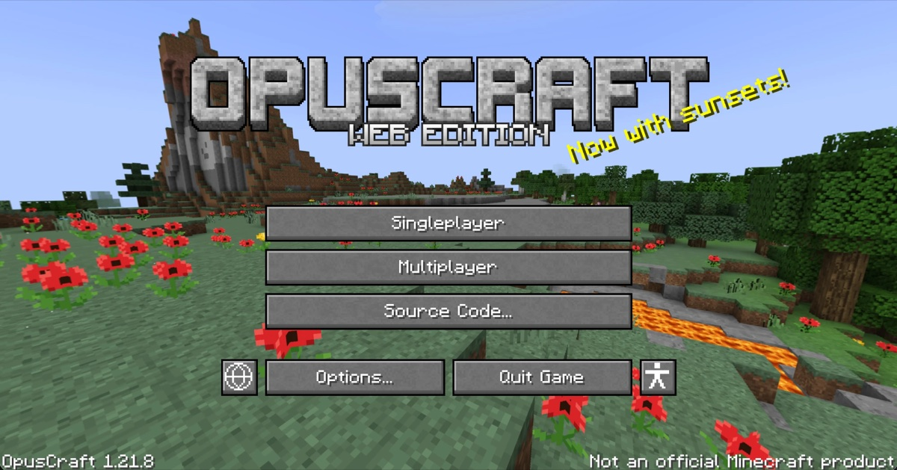

# OpusCraft

Minecraft Java Edition 1.21, rebuilt from scratch for the browser by Claude Opus 5.5.

**Play it: https://opuscraft.pages.dev** (best on a computer, with a keyboard and a mouse; phones and tablets play it by touch)



> NOT AN OFFICIAL MINECRAFT PRODUCT. NOT APPROVED BY OR ASSOCIATED WITH MOJANG OR MICROSOFT.

## What this is

A survival sandbox game that runs in a browser tab and is made to play like Minecraft Java Edition 1.21: its blocks,
items, mobs, recipes, structures and rules, as far as it has got.

All of it was written by an AI model, Claude Opus 5.5, working in Claude Code, with a person choosing what to build
and playtesting, in about a week. The game uses no files from Minecraft, and no image or audio files at all:

- every texture is drawn pixel by pixel, in code, when the game starts;
- every sound and every piece of music is synthesized as you play;
- every world is grown from its seed.

(The one picture in this repository, `public/og.jpg`, is a screenshot of the game, for this page and for link previews.)

It is about 230,000 lines of TypeScript on WebGL 2, with nothing to install to play and no libraries in the game
itself (TypeScript and Vite build it; `ws` carries multiplayer between computers).

## What's in it

- **The Overworld.** Biomes from deserts and badlands to snowy peaks, cherry groves, bamboo jungles, swamps, mushroom
  islands and deep oceans; caves, lush caves and the deep dark; weather, lightning, day and night.
- **Structures.** Five kinds of village, temples, woodland mansions, pillager outposts, ruined portals, shipwrecks,
  ocean ruins and monuments, buried treasure, strongholds, ancient cities and trial chambers.
- **The Nether.** Fortresses and bastion remnants; piglins, hoglins, striders, blazes, ghasts and wither skeletons.
- **The End.** The ender dragon fight, the outer islands, end cities, shulkers and the elytra, and the End Poem and
  credits when you win.
- **Mobs.** The usual monsters and farm animals; villagers that work, trade, breed and gossip, with iron golems,
  raids and illagers; wolves, cats, horses, llamas, foxes, frogs, axolotls, bees, pandas, dolphins and turtles;
  drowned, guardians, witches, phantoms, the warden and the breeze.
- **Things to do.** Mining, crafting with the recipe book, smelting, farming and breeding, enchanting, brewing,
  trading, archaeology; tridents, crossbows, shields and maces; fireworks and elytra flight; boats, minecarts and
  rails; maps, signs, armour stands and ender chests.
- **Redstone.** Dust, torches, repeaters, comparators, observers, pistons, dispensers, droppers, hoppers, tripwire,
  daylight detectors, jukeboxes and the crafter.
- **The rest of the game around it.** Survival, Creative, Adventure and Spectator; advancements; chat commands
  (`/gamemode`, `/tp`, `/give`, `/summon` and more); worlds saved in your browser, with backups you can export and
  import as files.
- **Multiplayer.** Up to eight players in one world, each in their own browser (see below).

## What isn't there yet

- On phones and tablets the touch controls are new and plain: there is no typing yet (chat, commands, signs), and a
  stack can't be split.
- Playing with friends straight from the public site. Multiplayer works when one player runs the game from this
  repository (see below).
- In multiplayer everyone is in the same dimension as the host: when the host goes to the Nether or the End, the
  others go too. It has been played by two people so far, not by eight.
- A handful of mobs and a number of smaller things. Where it differs from the original, that is a bug: issues are
  welcome.

## Play

### In your browser

Open https://opuscraft.pages.dev in a desktop browser with WebGL 2 (it is developed and played in Chrome and Safari). The keys are
the original's: WASD, Space, Shift, E, Q, T, F3, F5, Esc.

On a phone or a tablet, held sideways: slide your left thumb to move and drag a finger to look around; tap to place
or use, or to hit a mob; hold a finger still to break a block. Buttons jump, sneak and use, and the three dots beside
the hotbar open the inventory.

Your worlds are kept in your browser, for that site. **Make Backup** (Singleplayer, pick a world, **Edit**) saves a
world as a file, and **Import World** brings one back, on any computer.

### On your own computer

With [Node.js](https://nodejs.org) 22 or newer:

```bash
git clone https://github.com/Oppenheimerism/OpusCraft.git
cd OpusCraft
npm ci
npm run dev
```

then open http://localhost:5173.

### With friends

One player hosts, on their own computer; the others only need a browser.

1. The host double-clicks `start-lan.cmd` (Windows) or `start-lan.command` (macOS), or runs `npm run lan`. It builds
   the game and serves it on the local network, and says where.
2. The host opens http://localhost:4173, goes into a world, and presses Esc, **Open to LAN**, **Start LAN World**.
   The pause menu now shows a join code and **Copy Join Link**.
3. Friends on the same network (the same Wi-Fi, or a phone's hotspot) open the link and join from **Multiplayer**.

Friends' players, with everything they carry, are saved with the host's world. For friends farther away,
`npm run lan -- --tunnel` serves the game for a tunnel such as `cloudflared`, and says what to do.

## How it was made

Every commit here was written by Claude Opus 5.5 in Claude Code: some in sessions on a laptop, some in cloud sessions
that ran for hours on their own. A person chose what to build next, played each version, and reported what felt
wrong. The model wrote the code and the tests, working from what it knows of the original and from the Minecraft
Wiki, and the comments name the part of the original each piece follows.

It took about a week: the first commit is from 22 September 2026, and nearly all the rest are from the six days
after it. The commit messages are written for players, and read in order they tell how it grew.

## Development

```bash
npm run dev        # the game at http://localhost:5173, rebuilt as you edit
npm run build      # typecheck, then build to dist/ (static files: any web server can serve them)
npm run typecheck
```

The tests run the game's own code in Node, without a browser:

```bash
node scripts/regress.mjs                              # every suite (about 190; a long run on a laptop)
node scripts/regress.mjs tests/misc/lava-water.mjs    # one suite
```

Where things are: `src/world` (blocks and world generation), `src/game` (the rules), `src/entity` (mobs),
`src/item` and `src/inventory`, `src/render` (WebGL), `src/textures` (every texture, as code), `src/audio` (the
synthesizer), `src/gui` (screens), `src/net` (multiplayer), `src/storage` (saves), `scripts/` (the LAN server and the
test runner), `tests/`.

## Credits

- Direction and playtesting: Oppenheimerism.
- Code, textures, sounds and music: Claude Opus 5.5, by Anthropic, working in Claude Code.
- The original game: Mojang Studios.
- The End Poem is Julian Gough's, who released it into the public domain (CC0) in 2022.
- The Minecraft Wiki and its editors, for everything written down.

## License

[MIT](LICENSE).

"Minecraft" is a trademark of Mojang Synergies AB. This project is not affiliated with, endorsed by or approved by
Mojang or Microsoft.
